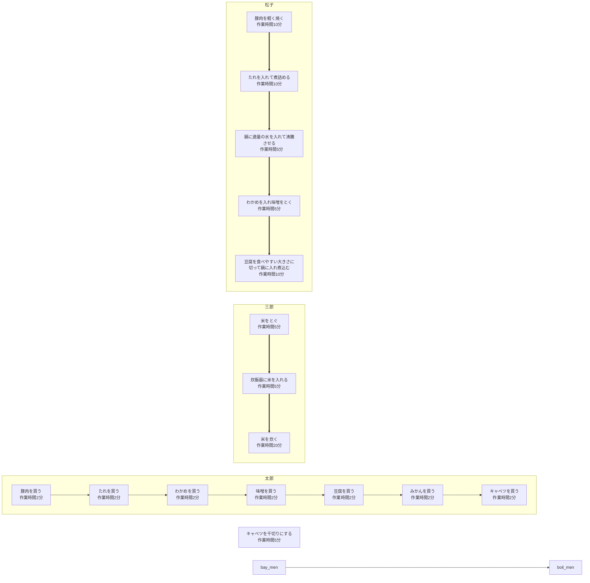

```mermaid

graph LR;

    bay_meat["豚肉を買う
    作業時間2分"]

    bay_sauce["たれを買う
    作業時間2分"]

    bay_seaweed["わかめを買う
    作業時間2分"]

    bay_miso["味噌を買う
    作業時間2分"]

    bay_tohu["豆腐を買う
    作業時間2分"]

    bay_orange["みかんを買う
    作業時間2分"]

    bay_cabbage["キャベツを買う
    作業時間2分"]

    boil_the_rice["米をとぐ
    作業時間5分"]

    rice_cooker["炊飯器に米を入れる
    作業時間5分"]

    cook_rice["米を炊く
    作業時間20分"]

   Lightly_sear_the_meat["豚肉を軽く焼く
   作業時間10分"]

    Add_the_sauce_and_bring_to_a_boil["たれを入れて煮詰める
    作業時間10分"]

    add_water["鍋に適量の水を入れて沸騰させる
    作業時間5分"]

    seaweed["わかめを入れ味噌をとく
    作業時間5分"]

    Cut_tofu["豆腐を食べやすい大きさに切って鍋に入れ煮込む
    作業時間10分"]

    cut_cabbage["キャベツを千切りにする
    作業時間5分"]


subgraph "太郎"

 direction LR

 bay_meat--->bay_sauce--->bay_seaweed--->bay_miso--->bay_tohu--->bay_orange--->bay_cabbage;

end


subgraph "三郎"

 boil_the_rice===>rice_cooker===>cook_rice;

end


subgraph "松子"

 Lightly_sear_the_meat===>Add_the_sauce_and_bring_to_a_boil===>add_water===>seaweed===>Cut_tofu


end
 bay_men-->  boil_men


```