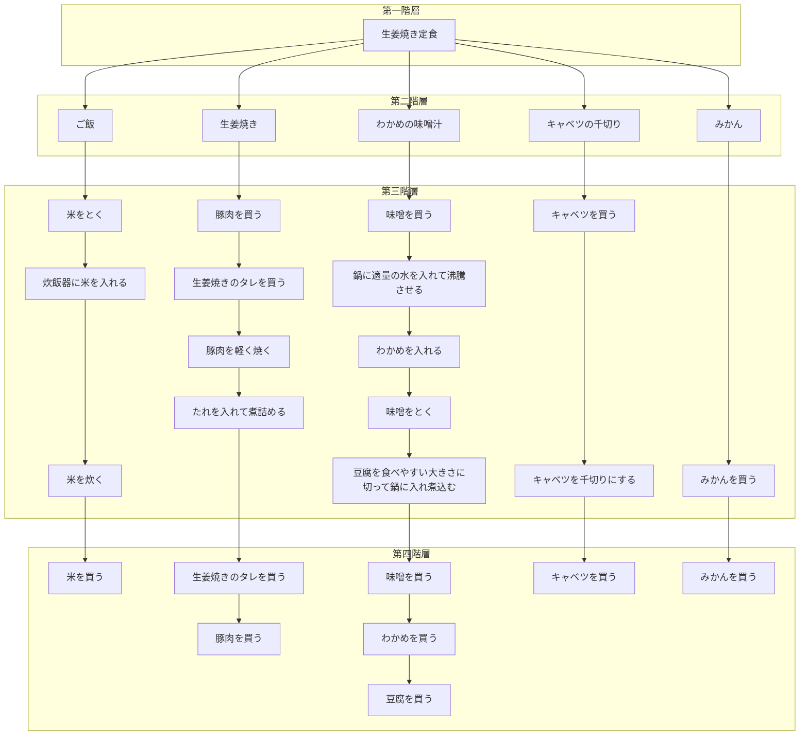

```mermaid
flowchart TB

subgraph "第一階層"
    Ginger_grilled_set_meal["生姜焼き定食"]

end

subgraph "第二階層"
    rice["ご飯"]

    Ginger_grilled["生姜焼き"]

    Soup["わかめの味噌汁"]

    garnish["キャベツの千切り"]

    dessert["みかん"]
end

subgraph "第三階層"

    boil_the_rice["米をとく"]

    rice_cooker["炊飯器に米を入れる"]

    cook_rice["米を炊く"]

    buy_pork["豚肉を買う"]

    Ginger_grilled_sauce["生姜焼きのタレを買う"]

    Lightly_sear_the_meat["豚肉を軽く焼く"]

    Add_the_sauce_and_bring_to_a_boil["たれを入れて煮詰める"]

buy_miso["味噌を買う"]

add_water["鍋に適量の水を入れて沸騰させる"]

seaweed["わかめを入れる"]


Soak_the_miso["味噌をとく"]

Cut_tofu["豆腐を食べやすい大きさに切って鍋に入れ煮込む"]


buy_cabbage["キャベツを買う"]

cut_cabbage["キャベツを千切りにする"]

buy_orange["みかんを買う"]
end

subgraph "第四階層"

buy_rice["米を買う"]

pork["豚肉を買う"]

buy_sauce["生姜焼きのタレを買う"]

miso["味噌を買う"]

buy_seaweed["わかめを買う"]

buy_tofu["豆腐を買う"]

cabbage["キャベツを買う"]

mandarin["みかんを買う"]

end
Ginger_grilled_set_meal-->rice

Ginger_grilled_set_meal-->Ginger_grilled

Ginger_grilled_set_meal-->Soup

Ginger_grilled_set_meal-->garnish

Ginger_grilled_set_meal-->dessert

rice-->boil_the_rice-->rice_cooker-->cook_rice

Ginger_grilled-->buy_pork-->Ginger_grilled_sauce-->Lightly_sear_the_meat-->Add_the_sauce_and_bring_to_a_boil

Soup-->buy_miso-->add_water-->seaweed-->Soak_the_miso-->Cut_tofu

garnish-->buy_cabbage-->cut_cabbage

dessert-->buy_orange

cook_rice-->buy_rice

Add_the_sauce_and_bring_to_a_boil-->buy_sauce-->pork

Cut_tofu-->miso-->buy_seaweed-->buy_tofu

cut_cabbage-->cabbage

buy_orange-->mandarin

```
